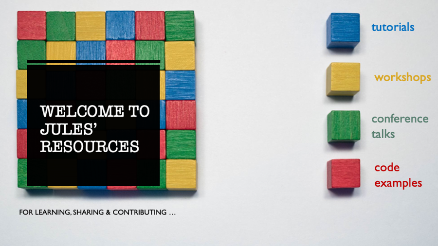

# Tutorials and Workshops

This repository contains tutorials for Apache Spark, Delta Lake, Koalas, MLflow, Databricks, and other. 

Aside from tutorials, this repo also has talks and workshops I have conducted at meetups and conferences.

Have fun!

Cheers,

Jules

