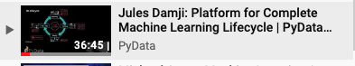

# Tutorials, Talks and Workshops

This repository contains some talks, videos, and slides for the conferences. In each directory, you will
find a _filename.dbc_, which is a collection of Databricks notebooks used as part of the tutorial and presenation. You can
download these _.dbc_ files and upload them in your [Databricks Community Edition](https://databricks.com/try)*[]: 

* [PyData Miami](./pydata/pydata_miami)
  * 
* [PyData SF](./pydata/pydata_sf)

